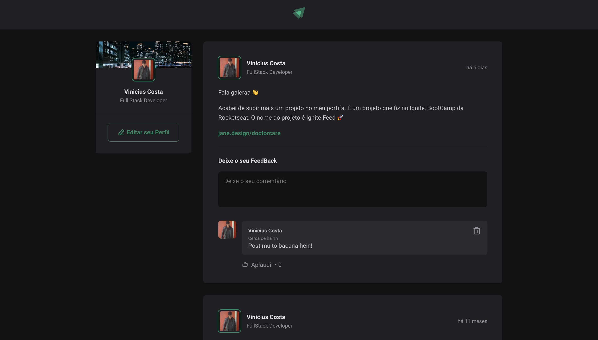

# 📸 Overview:


# 💻 Project:
## Aplicação que simula uma social media

# 🚀 Technologies:
### ✔️ ReactJS 
### ✔️ TypeScript
### ✔️ Vite

# How to run

```
# Clone this repository
$ git clone https://github.com/vinnycosta9898/ignite-feed

# Go to the directory
$ cd ignite-feed

# Install Dependencies
$ npm install

# Run Web Server
$ npm run dev